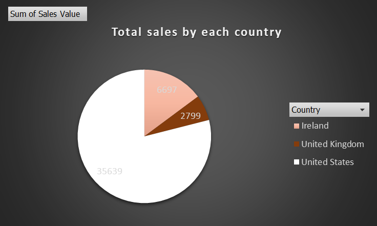
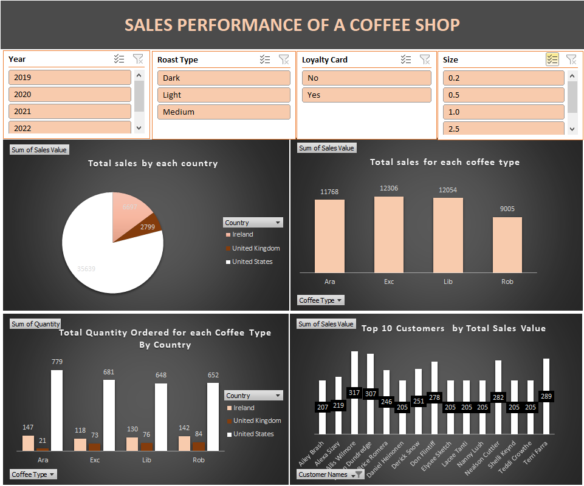

# Company P

# Introduction
This is a report that presents an overview of sales performance for a coffee shop over a period of four years (2019-2022). It displays various metrics, such as total sales by country, sales by coffee type, quantity ordered by coffee type and country, and the top 10 customers by total sales value. The analysis is intended to provide insights into the sales distribution and customer preferences to help the business make data-driven decisions.

**_Disclaimer_** : _All data set do not represent any company, institution or country, but just a dummy data set to demonstrate the capabilities of Excel._

## Problem Statement
The coffee shop aims to identify key sales trends and performance indicators to improve customer engagement, optimize inventory, and increase revenue. Specifically, they want to understand:
1. Which countries generate the most sales?
2. Which coffee types are most popular among customers?
3. How does coffee preference vary by country?
4. Who are the top customers contributing to sales, and how can this information be used to drive further business growth?

## Data Sourcing
An imaginary shopping data set.

## Data Transformation
The overall process for data transformation includes the following:
Before analysis, the raw data was cleaned and processed:
- I made sure that all fields in the dataset were properly formatted (e.g., date, text, integer, binary).
- Using Excel, I eliminated duplicates and cleaned the data to get it ready for analysis.
- I fetched some data from other sheets using excel functions.
- I also grouped the necessary rows and columns for the analysis.

## Analysis and Visualization.
With the aid of pie charts, bar charts, and column graphs, I presented the total sales accordint to countries, coffee types and so on.Through this analysis, it was revealed that USA has the highest sales among the three countries.

### Total Sales Based on Coffee Type

  ---

  ### Total Sales by Country

  ---

  ### Total Quantity Sold by Coffee Type

  ---

  ### Top 10 Customers

  ---

  ### Sales Performance Dashboard

  ---

  # Conclusion
The sales performance analysis highlights a clear dominance of the U.S. market, with substantial contributions from select coffee types. The coffee shop could use these insights to expand sales further in underperforming regions and encourage repeat purchases from top customers. Focused marketing strategies and improved inventory management are key to increasing overall sales and profitability.

# Recommendation
1. Expand U.S. Market Presence: Given that the U.S. has the highest sales, further efforts could be made to increase market share, such as promotions or localized marketing campaigns.
2. Increase Sales in U.K. and Ireland: Consider tailored strategies, like promotions or introducing new flavors, to boost sales in these regions. Understanding regional preferences could help the coffee shop cater better to these markets.
3. Focus on Popular Coffee Types: Since "Exc," "Lib," and "Ara" have high sales, promoting these varieties further, possibly through special offers or seasonal marketing, could drive more revenue. Efforts could also be made to understand why "Rob" is less popular and address this with targeted campaigns or product improvements.
4. Customer Loyalty Programs: Develop a loyalty program aimed at retaining top customers, encouraging them to buy more frequently. Personalized promotions or exclusive offers could increase sales further.
5. Inventory Management: Given the variation in quantity ordered by coffee type and country, optimizing inventory based on demand could help reduce costs and improve stock availability.
THANK YOU 😄
